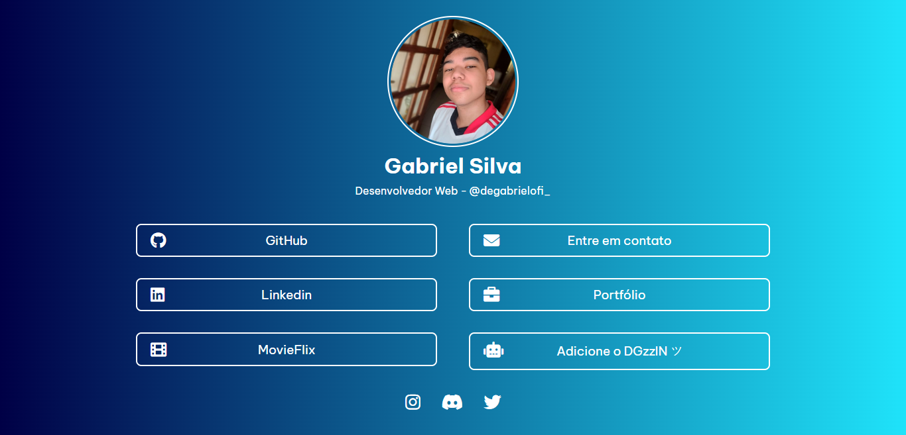

<p align="center">
   
  </p>

# :clipboard: Sobre o projeto

O projeto abaixo é uma simples página, no qual foi feita para colocar os links de suas principais redes sociais, aonde você possa ajudar as pessoas que entram em alguma rede social sua, a encontrar outros links importantes, como o seu [Likedln](https://www.linkedin.com/in/degabrielofi/), [Github](https://github.com/degabrielofi) ou [Email](mailto:contatodegabrielofi@gmail.com) por exemplo.

Veja abaixo o resultado do projeto:

<br>
<p align="center">
   
  </p>

# 🔗 Acesse o site com o link abaixo. 

- [MyLinks](https://mylinks-degabrielofi.vercel.app/)


## :computer: Tecnologias utilizadas
Este projeto foi desenvolvido com as seguintes tecnologias:
- [React.js](https://pt-br.reactjs.org/)
- [Node.js](https://nodejs.org/en/)
- [JavaScript](https://www.javascript.com/)
- [Styled-Components](https://styled-components.com/)
- [HTML](https://developer.mozilla.org/pt-BR/docs/Web/HTML)
- [CSS](https://developer.mozilla.org/pt-BR/docs/Web/CSS)


## 🕵️‍♂️ Para clonar o repositório utilize:
```bash
 git clone https://github.com/degabrielofi/MyLinks
```

## 👨🏻‍💻 Para instalar as dependências use o comando abaixo: 
```bash
 npm i styled-components react
```

## 🌐 Para iniciarlizar o projeto utilize o comando abaixo:
```bash
 npm start
```

## 

## 😃 Gostou? Me siga no > [Likedln](https://www.linkedin.com/in/degabrielofi/)
