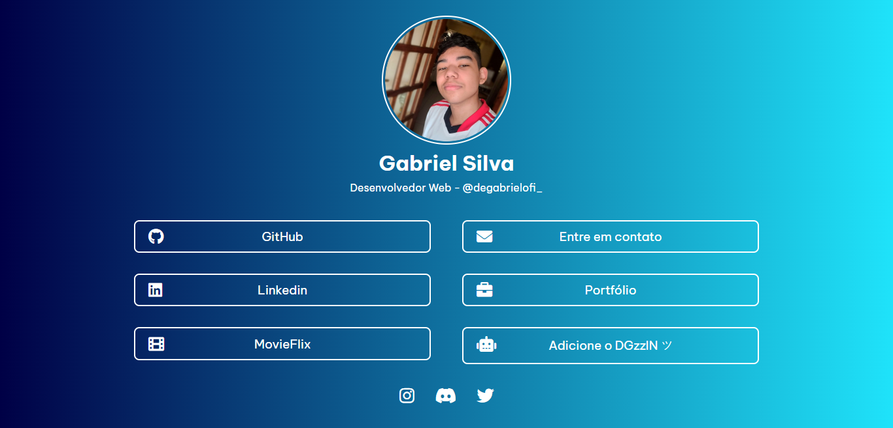

# MyLinks — Gabriel Pereira

> Página de links oficiais do Gabriel Pereira, Founder & CEO da [Guebly](https://guebly.com.br).



## ✨ Features

| Feature | Descrição |
|---|---|
| **Dark / Light Mode** | Toggle manual + respeita `prefers-color-scheme` do sistema. Preferência salva no `localStorage`. |
| **Skeleton Loading** | Imagens hero das empresas exibem shimmer animado enquanto carregam — sem layout shift. |
| **Analytics de cliques** | Cada link rastreia cliques (id, label, count, lastClick) no `localStorage` sem dependências externas. |
| **Animações de entrada** | `fadeIn` no hero e `fadeUp` escalonado nos panels via `@keyframes` do styled-components. |
| **SEO / Open Graph** | Meta tags completas: description, og:title, og:image, og:locale, twitter:card. Pronto para compartilhamento em qualquer rede. |
| **Acessibilidade** | `aria-label` em todos os links e botões, `aria-hidden` em ícones decorativos, `role="status"` no toast, `focus-visible` outline em todos os interativos. |
| **Compartilhar** | Web Share API nativa (mobile) com fallback para clipboard (desktop). |

## 🗂 Estrutura

```
src/
├── context/
│   └── ThemeContext.jsx      # Context + Provider para dark/light mode
├── hooks/
│   └── useAnalytics.js       # Hook de tracking de cliques (localStorage)
├── components/
│   └── LazyImage.jsx         # Wrapper de  com skeleton shimmer
├── Home/
│   ├── index.jsx             # Componente principal da página
│   └── style.jsx             # Todos os styled-components + CSS variables de tema
├── assets/                   # Imagens (hero, avatar, ícones)
├── global.css                # Reset + body theming
└── index.js                  # Entry point (React root + ThemeProvider)
public/
└── index.html                # Meta tags SEO, OG, Twitter Card, fontes
```

## 🎨 Temas

As cores são definidas via CSS custom properties no `style.jsx` (`ThemeTokens` global style):

```css
/* Dark (padrão / sistema) */
:root[data-theme="dark"] { --bg-page: ...; --text-primary: #fff; ... }

/* Light */
:root[data-theme="light"] { --bg-page: ...; --text-primary: #1a0a30; ... }
```

O atributo `data-theme` é setado em `document.documentElement` pelo `ThemeContext`.

## 📊 Analytics local

Os cliques ficam em `localStorage["mylinks-analytics"]`:

```json
{
  "guebly_holding": { "label": "Guebly Holding", "count": 3, "lastClick": "2024-01-15T10:30:00.000Z" },
  "linkedin":       { "label": "LinkedIn",        "count": 1, "lastClick": "2024-01-15T10:31:00.000Z" }
}
```

Para integrar com Plausible ou outra ferramenta, basta editar `src/hooks/useAnalytics.js`.

## 🚀 Rodando localmente

```bash
npm install
npm start
```

## 🏗 Build de produção

```bash
npm run build
```

## 🛠 Stack

- React 18
- styled-components 5
- react-icons 5
- Create React App
